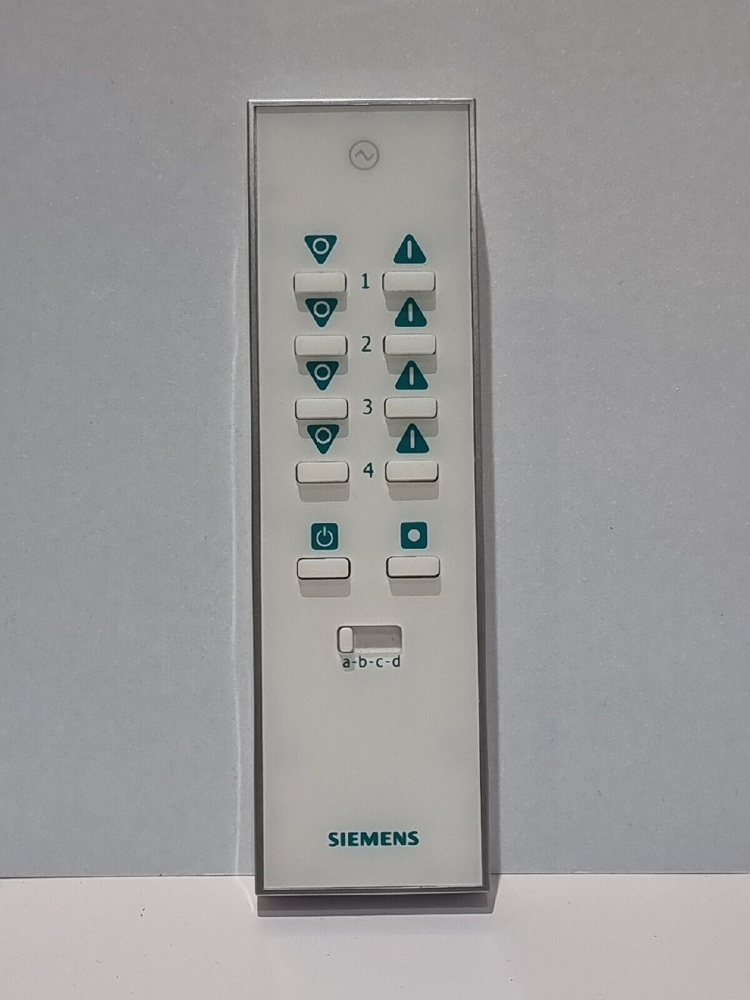
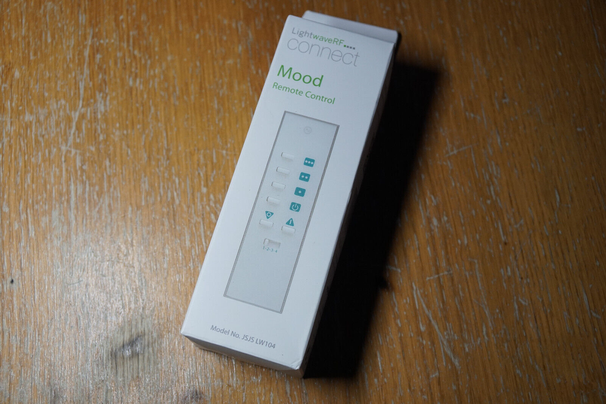
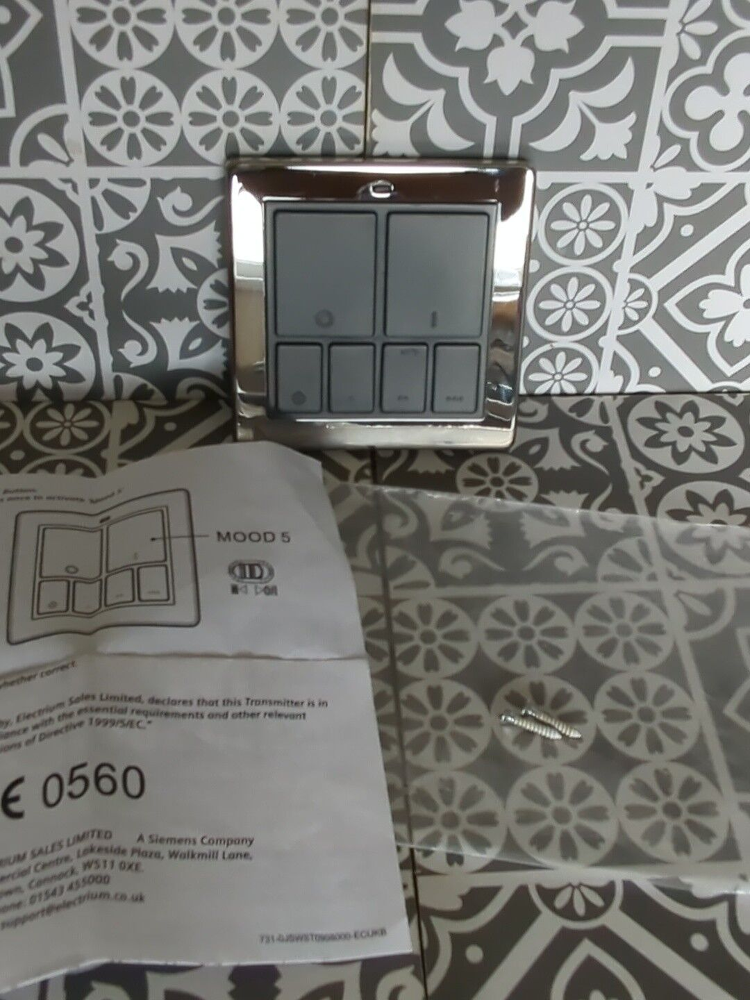
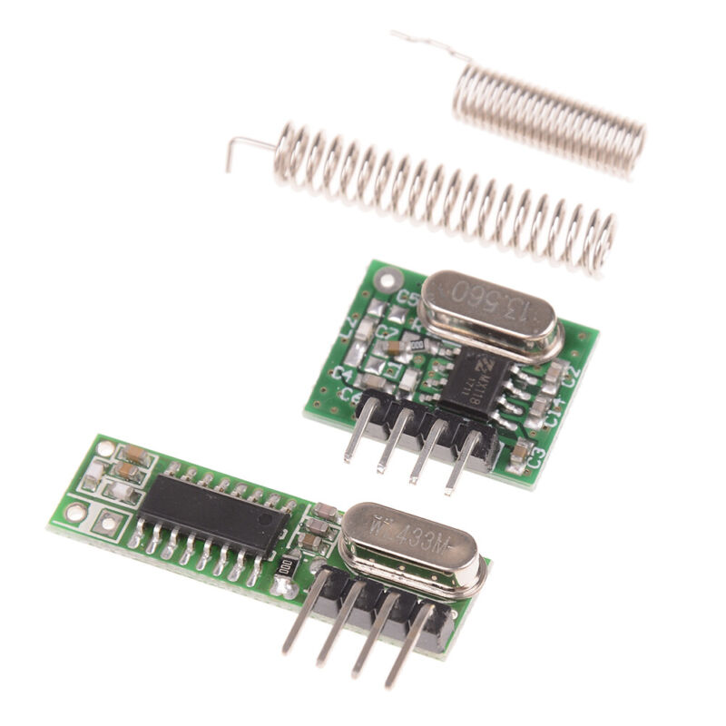
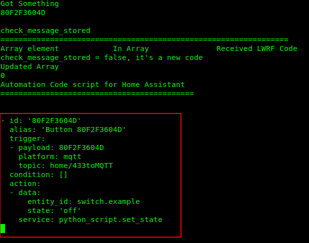
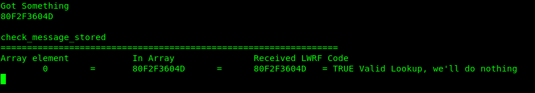

# LightwaveRF to MQTT receiver. 

This app sniffs the legacy Gen 1 LightwaveRF device identifiers sent by the hub or remote controls over 433Mhz RF and sends them over MQTT on the selected topic. This  can then be used within a Home Automation automation script to change the device state when these devices are triggered.
Specifically this is setup for Home Assistant but it's pretty straightforward to edit the code for other Home Automation platforms. 

Please note this won't work with LightwaveRF Gen2 devices which use 868Mhz RF and are two way anyway.

# Overview of LightwaveRF 

The LightwaveRF Generation one devices use a one way (send only) protocol with no status feedback to the Hub if the device state is changed by another device. This means that the status of a Gen1 LWRF device in home automation systems such as Home Assistant can easily get out of sync with the real world since the device can be controlled by one of many methods that bypass the home automation platform:

- Hand held remote controls 
    e.g. 

 
- Scene controllers

- Hub Timers
- Phone app

These control devices are paired directly with the LightwaveRF device or send instructions to the hub which doesn't send out status updates (Gen1).

This application can't overcome the issue where a device is triggered directly i.e. a socket is turned on or off by someone. 

## Control non LightwaveRF devices with Remote Controls.
This app helps when combined with a Home Automation automation script that listens to a MQTT Topic and sets the LWRF Device status when the automation is triggered. In addition to setting a Gen1 Device state, this will allow you to use the lightwaveRF remote controls to control other devices in Home Assistant (or another Home Automation Platform).

# Build the Receiver
You will need to wire a 433 receiver to an ESP8266 or ESP32. 

It's three wires and two of them are power. 

Unfortunately, while the 433 Receivers are cheap, picking one that works well over distance can be more challenging. What you are looking for is a receiver with a crystal (silver box) that states it is a "super heterodyne" receiver. The ones I am using look like the image below and seem to work well. 

To avoid confusion, the long one is the receiver!



I'd recommend that the receiver data pin is connected to D2 on the ESP microcontroller. I'm using a Wemos D1 mini.


# How to setup
## Compilation 
This application is based on the excellent work by Bob Tidey (robert@tideys.net) you will need to install the library from this repo into your ~/Arduino folder in order to compile this. 

https://github.com/roberttidey/LightwaveRF/tree/master

Copy the ```config.h.example``` file to ```config.h``` . 
Edit the parameters in this file for your setup.

## Home Assistant
You will need to install the python script set_states.py in your home assistant configuration directory.

Download from this repository  https://github.com/rodpayne/home-assistant/blob/main/.homeassistant/python_scripts/set_state.py 

Save the file in python_scripts
```
<home assistant configuration directory>/python_scripts/set_state.py
```
You'll need to restart Home Assistant once you've copied the python script to the directory. 

# How to use

Once compiled and running on the ESP with the connected 433 RF receiver, press the buttons on your handheld remotes, scene controllers, phones or timed actions from the hub. The ESP will capture this RF code and display the automation code for Home Assistant on the Serial Console of the ESP. 




Copy and paste this code into your ```automation``` file/folder and edit as required to mimic what you want to happen to the Home Assistant entity states. 

You will still need to manually setup which devices are being controlled.

Example Home Assistant Automation:

```
- id: '0C00000003000B0E0801'
  alias: 'Button 0C00000003000B0E0801'
  trigger:
  - payload: 0C00000003000B0E0801
    platform: mqtt
    topic: home/433toMQTT
  condition: []
  action:
  - data:
      entity_id: switch.hall_lamp
      state: 'on'
    service: python_script.set_state
  - data:
      entity_id: light.hall_main
      state: 'on'
    service: python_script.set_state
  - data:
      entity_id: light.hall_landing
      state: 'off'
    service: python_script.set_state
  - data:
      entity_id: switch.hall_rgb
      state: 'off'
    service: python_script.set_state
  - data:
      entity_id: switch.outside_rgb_power
      state: 'off'
    service: python_script.set_state
  - data:
      entity_id: switch.spotlight
      state: 'off'
    service: python_script.set_state
```

# Avoiding Duplication
The code will only generate the Home Assistant Automation once for each session. To reset the session just hit the reset button or power cycle your ESP device. 

If a duplicate code is received you'll get something like this:


# Based on work by
[@github/roberttidey](https://github.com/roberttidey)

[@github/rodpayne](https://github.com/rodpayne/home-assistant/blob/main/.homeassistant/python_scripts/set_state.py)

